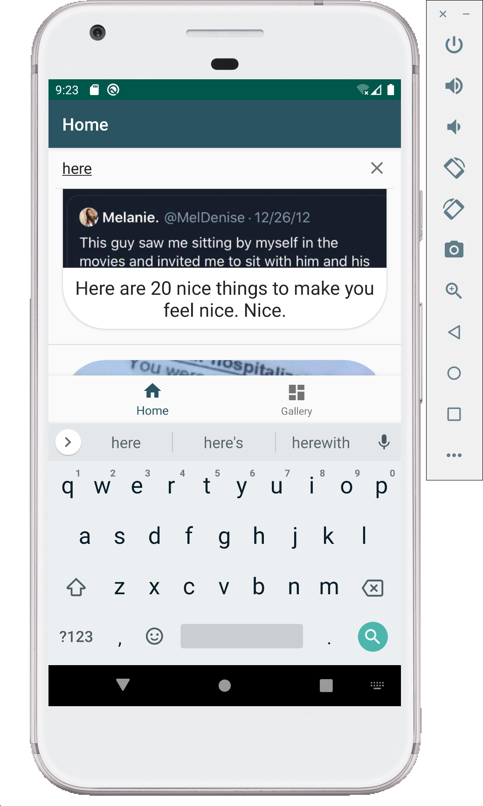
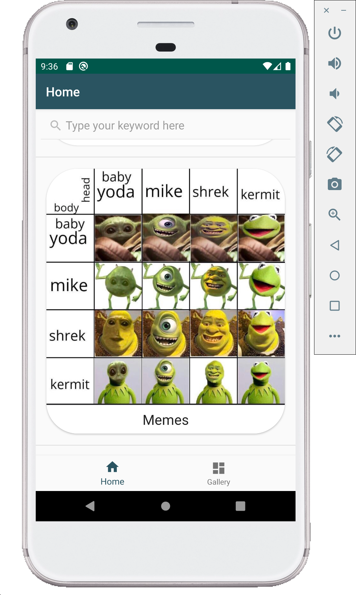

# DEV_epicture_2019
3rd year project in Java in which the goal is to build an Imgur client mobile photo finder and browsing application.
It uses the JVM environment on Android and target the Android SDK API 28. Gradle is the build automation system and can be launched with the help of Gradle Wrapper tool or directly on Android Studio.
The mobile application implements imgur API in order to fetch pictures from the DataBase and detailed informations (titles, descriptions, users ...).

It also offers a nice and polish user interface/experience as well as the following functionalities :

    • Authenticate to the Imgur platform
    • Display photos put online by the user connected in the form of a feed.
    • Search for photos on the plateform.
    • clickable and resizable pictures.
    • Upload photos to the plateform.
    • Filter the displayed photos.
    
PREREQUISITES :

    Android Studio + Android SDK API 28/29.

USAGE :

    Open and run the project on Android Studio.

